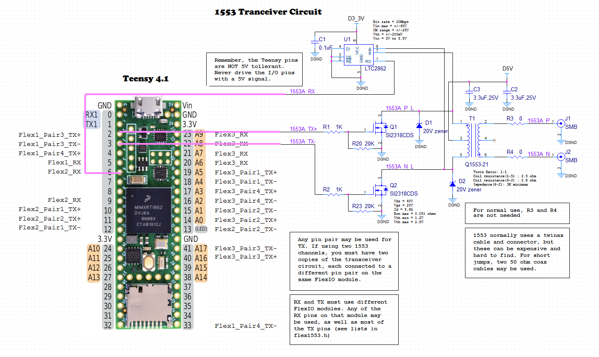

# Flex1553 - MIL-STD-1553 for Teensy 4

===========================================

This is a first-cut at a MIL-STD-1553 interface using the Teensy 4 FlexIO
as part of the hardware interface. My need was for a Remote
Terminal (slave) interface, so that module is better thought out and more
complete, though could still use more work on the API. The Bus Controller
(master) interface is more rudimentary, but functional.

## Compatibility

This library is compatible with Teensy 4.0 and 4.1 boards only. The FlexIO
peripheral found in these boards is used as the protocol engine that makes
it all work.

## Background

MIL-STD-1553 is a serial communication protocol developed for the military
in the late 1970's, and is still used today in many military vehicles and
aircraft. It has also found its way into some industrial applications. It is
very reliable and fairly fast with a 1Mb/s bit rate. You could consider it
a predecessor to CAN bus.

On the down side, it is a fairly difficult standard to implement at the
physical layer and is generally must be done with custom peripheral IC's,
or in recent years, with an FPGA. FlexIO gives us a new tool to use for
custom or uncommon protocols. This might not be a military grade solution,
but it is good enough to communicate with 1553 devices, at least for test
purposes.

## Example code

This shows the basics of how to use the 1553 bus controller. For a complete
example, see examples/BC_get_packet.cpp

Instantiate 1553 classes

      #include <Flex1553.h>
      #include <MIL1553.h>

      // This configures FlexIO1 as a 1553 transmitter on pins 2&3
      //             and FlexIO2 as a 1553 receiver on pin 6
      FlexIO_1553TX flex1553TX(FLEXIO1, FLEX1553_PINPAIR_3);
      FlexIO_1553RX flex1553RX(FLEXIO2, 6);

      // This class combines the transmitter and receiver to support
      // the basic packet operations of a 1553 bus controller.
      MIL_1553_BC  myBusController(&flex1553TX, &flex1553RX);

      // This is just a contaier for the packet data
      MIL_1553_packet myPacket;

Configuration of FlexIO and initialization of objects

      void setup() {
         // configure FlexIO for 1553
         if( !myBusController.begin() )
            Serial.println( "myBusController.begin() failed" );
      }

Request data from RT

      void SendRequest()
      {
         // setup the packet to request 4 words from device 5, subaddress 2
         myPacket.setWordCount(4);  // requested word count
         myPacket.setRta(5);        // Remote Terminal Address
         myPacket.setSubAddress(2); // subaddress is basically a register number

         // This will send the request packet.
         // It does not wait for the hardware to finish, it just gets
         // it started and it runs on FlexIO and interrupts from there.
         myBusController.request(&myPacket, FLEX1553_CH_A);
      }

         // The returned data will be loaded into myPacket.
         // the main loop() polls getRxCount() to determine when the has
         // been received

Poll for the response

      int rxCount = 0; // will count how many new data words have been received.

      void loop() {
         int error = 0;

         // check for 1553 response
         if(rxCount != myPacket.getRxCount()) { // got some new data
            rxCount = myPacket.getRxCount();
            wc      = myPacket.getWordCount();

            // check for errors
            if(myPacket.getParityErr() == true) {
               Serial.println("Parity error detected");
               error = -1;
            }
            if(myPacket.getBitFault() == true) {
               Serial.println("Transition fault detected");
               error = -2
            }

            // did we get the whole packet?
            if(error == 0 && rxCount == wc + 1) { // packet data words + STATUS
               switch(myPacket.getSubAddress()) {
                  case 1:
                     // do something with subaddress 1 data
                     break;
                  case 2:
                     // do something with subaddress 2 data
                     break;
               }
            }
         }
      }

## Hardware

Due to the transformer coupled bus, some external hardware will always be
needed for 1553. The required circuitry is shown here (for a single channel).

Only three pins are needed per channel, two for transmit and one for receive.
The lists of valid pins are shown below.

T1 is the key component here. This transformer couples our signals to the
bus and increases the voltage from our local 3.3V levels to about 20Vpp
levels on the bus. The bus itself is bidirectional, meaning that signals
travel in both directions (transmit and receive). The transformer used here
is designed specifically for 1553 use, substitutions are not advised.

Q1 and Q2 are driver transistors for the transformer. 5V power is sourced
to the center tap of the transformer, and with both transistors off, all
primary pins of the transformer will be at 5V and no current flows. If one
of the transistors turns on, it will pull that end of the transformer to
ground and cause a current flow, which will induce a output into the
secondary.

When transmitting, Q1 will come on to drive the bus high, or Q2 will come
on to drive it low. They never come on at the same time, nor are they ever
both off during a transmit.

The rest of the time (when receiving or idle) both Q1 and Q2 will be off,
so the transformer is not producing any output. But signals may still
travel in the opposite direction, from the bus, back through the
transformer to the output of our transistors. Normally these would be at
5 volt levels, but just to be safe, we have D1 and D2 to shunt off any
voltages that might be high enough to damage our circuitry.

U1 is a receiver circuit (intended for RS-485 designs) which is being used
to capture the incoming signals and translate the 5V differential input to
the 3.3V level that our Teensy receiver will need.

J1 and J2 are standard 50 ohm connectors. 1553 normally makes use of
"twinax" connectors, which have both positive and negative signals, as well
as ground, in the same connector. These connectors, and the related cable,
is hard to get, and quite expensive. I have seen that using two standard 50
ohm cables (in reasonably short, matched lengths), will work just fine.

R3 and R4 are sometimes needed, depending upon your bus connection.

### TX Pin pairs

This was written so that the transmitter can use two sets of output pins
(channel A and channel B). They both use the same transmitter but pretend
to be two different channels. The intent here is to provide two transmitters
and two receivers in three FlexIO modules. The receivers need to operate
simultaneously, but the transmitters do not. If this feature is not needed,
pass a -1 for the pinPairB parameter in the TX constructor.

A 1553 transmitter needs a differential output (two pins) to control the
required isolation transformer. Due to the way that FlexIO uses pins in
State Machine mode, these are the only combinations of pins available for
TX:

    Teensy 4.1
    FlexIO_1:         FlexIO_2:          FlexIO_3:          Define:
     pair1: n/a        pair1: 10,12       pair1: 19,18       FLEX1553_PINPAIR_1
     pair2: n/a        pair2: 11,13       pair2: 14,15       FLEX1553_PINPAIR_2
     pair3: 2,3        pair3: n/a         pair3: 40,41       FLEX1553_PINPAIR_3
     pair4: 4,33       pair4: n/a         pair4: 17,16       FLEX1553_PINPAIR_4

Each pin pair is listed in the order of ***pos***, ***neg*** pins. These
will control the FET drivers and isolation transformer needed for standard
1553. Pay attention to the order. If you get them backwards, it wont work.

Configure FlexIO module and the pins pair(s) that you would like to use when
instantiating FlexIO_1553TX().

### RX Pins

Each receive channel requires one FlexIO module. These are the pins which
may be used for the data receive line:

     Teensy 4.1
      FlexIO_1          FlexIO_2         FlexIO_3
       2,3,4,5,33        6,9,11,13        14,15,16,17,20,21,22,23,40,41

This is configured by the receiver class constructor, FlexIO_1553RX().

### Bill Of Materials

      Qnt       Ref               Part          Supplier    Part Num                  Footprint
      ____________________________________

      1         C1                0.1uF         Digi-Key    311-1142-1-ND             0805-2012
      2         C2,C3             3.3uF,25V     Digi-Key    445-6966-1-ND             0805-2012
      2         D1,D2             20V zener     Digi-Key    SMAJ5932BTPMSCT-ND        DO-214AC
      2         J1,J2             SMB           Digi-Key    J613-ND
      2         Q1,Q2             SI2318CDS     Digi-Key    SI2318DS-T1-E3CT-ND       SOT23-3
                  Substitute      SI2304DDS     Digi-Key    742-SI2304DDS-T1-BE3CT-ND
      2         R1,R2             1K            Digi-Key    P1.00KCCT-ND              0805-2012
      2         R20,R23           20K           Digi-Key    P20.0KCCT-ND              0805-2012
      2         R3,R4             0             Digi-Key    311-0.0ARCT-ND            0805-2012
      1         T1                Q1553-21      Mouser      673-Q1553-21
      1         U1                LTC2862       Digi-Key    LTC2862CS8-2#TRPBFCT-ND   SOP8
      1                           Teensy4.1     PJRC        TEENSY41                  48D2430Y600

## Software architecture

This is a Packet level interface to MIL-STD-1553 transceiver. Lower level
classes (Flex1553RX.cpp and Flex1553TX.cpp) are directly controlling FlexIO
hardware, either a transmitter or receiver, but not both. A full 1553
packet requires both sending (command or data) and receiving (data or
status). The classes which brings it all together are MIL_1553_BC (master)
and MIL_1553_RT (slave). These two classes reside in MIL1553.cpp. Only one
of these two classes should be instantiated.

The MIL_1553_xx classes support sending/getting only a single 1553 packet
(up to 32 words of data). This class replaces the ISR in Flex1553RX.cpp,
with a more sophisticated version that works with a packet class.

### MIL_1553_BC (in MIL1553.cpp)

This is the bus controller class. This class supports the basic packet
operations of a 1553 bus controller. It sets up the control word and
handles the acknowledge. This requires the use of one FlexIO_1553TX and one
or two FlexIO_1553RX instances.

### MIL_1553_RT (in MIL1553.cpp)

This is the remote terminal class. This is setup as mailboxes, where each
mailbox refers to one subaddress. There may be up to two instances of this
class, where each instance is used for one 1553 bus. If using two buses,
each will use its own instance of FlexIO_1553RX, and FlexIO_1553TX is shared
between the two. If using two buses, the buses operate independently, they
do not work as a redundant pair.

There can only be one Flex1553RX or Flex1553TX instantiation for each FlexIO
module. In the case of the i.MXRT1062, there are three FlexIO modules, and
you would typically implement one TX class and one or two RX classes. You
can not have two instances pointing to the same FlexIO module.

### MIL_1553_packet (in MIL1553.cpp)

This class is just a container for packet configuration and data. This is
where you would set your RTA and data to send to an RT or BC.

In the case of RT mailboxes, each mailbox is a MIL_1553_packet class, which
is attached to the MIL_1553_RT class.

### FlexIO Configuration (Flex1553TX.cpp and Flex1553RX.cpp)

The hardware design of this project relies heavily on FlexIO, which handles
the most time critical parts of data transmit and receive. This is tied to
software via interrupts (still fairly time critical) to handle protocol.
For detailed information on the FlexIO circuits, refer to the files in the
/docs directory.

## References

* [MIL-STD-1553.pdf](https://nepp.nasa.gov/docuploads/43745C0A-323E-4346-A434F4342178CD0E/MIL-STD-1553.pdf)
* [REVIEW AND RATIONALE OF MIL-STD-1553 A AND B](https://www.milstd1553.com/wp-content/uploads/2012/12/MIL-STD-1553B.pdf)
* [www.milstd1553.com](https://www.milstd1553.com/)
* [DDC Website](https://www.ddc-web.com/en/connectivity/databus/milstd1553-1) (requires login)

For detailed information on FlexIO, refer to the NXP reference manual,
Chapter 50. (Look for "i.MX RT1060X Processor Reference Manual" on
[NXP Website](https://www.nxp.com/products/processors-and-microcontrollers/arm-microcontrollers/i-mx-rt-crossover-mcus/i-mx-rt1060-crossover-mcu-with-arm-cortex-m7-core:i.MX-RT1060)).

For a crash course in FlexIO, see miciwan's excellent 'getting started' writeup
[How-to-start-using-FlexIO](https://forum.pjrc.com/threads/66201-Teensy-4-1-How-to-start-using-FlexIO)
